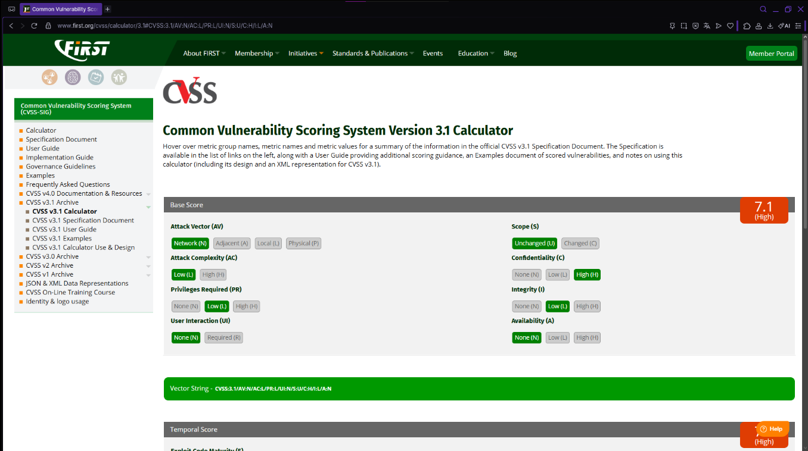

# SQL Injection

## Descripción de la vulnerabilidad

SQL Injection es una vulnerabilidad que ocurre cuando una aplicación utiliza directamente los datos ingresados por el usuario para construir consultas SQL, sin validar correctamente la información recibida.

Si un atacante logra aprovechar este problema, puede modificar la consulta original y acceder a información que normalmente no debería estar disponible. Dependiendo del sistema afectado, también podría modificar o eliminar registros almacenados en la base de datos.

En un portal como el de la Municipalidad de Cerro Verde, una vulnerabilidad de este tipo podría comprometer información de ciudadanos, funcionarios, solicitudes municipales y otros registros importantes para el funcionamiento de la institución.

---

# Evidencia de la vulnerabilidad

Durante la auditoría realizada en DVWA, configurado con el nivel de seguridad **Low**, se utilizó el siguiente payload:

```sql
1' OR '1'='1
```

Con este payload la aplicación respondió mostrando todos los usuarios almacenados en la base de datos, en lugar de entregar solamente el registro solicitado.

Esto demuestra que la aplicación interpreta directamente la entrada del usuario dentro de la consulta SQL, permitiendo alterar su funcionamiento mediante una condición siempre verdadera.

## Evidencia obtenida

### Evidencia de explotación


*Figura 1. Ejecución exitosa de SQL Injection utilizando el payload `1' OR '1'='1'. Como resultado, la aplicación devolvió todos los registros almacenados en la base de datos, confirmando la existencia de la vulnerabilidad.*

---

### Cálculo CVSS v3.1



*Figura 2. Resultado obtenido mediante la calculadora oficial CVSS v3.1 utilizada para determinar la gravedad de la vulnerabilidad.*

### Vector CVSS

```text
CVSS:3.1/AV:N/AC:L/PR:L/UI:N/S:U/C:H/I:L/A:N
```

## ¿Qué significa este puntaje?

El puntaje obtenido corresponde a una vulnerabilidad de severidad **Alta**.

Esto significa que la vulnerabilidad puede ser explotada de forma remota, con poca dificultad técnica y sin necesidad de que otro usuario participe en el ataque.

Durante la prueba realizada fue posible acceder a información almacenada en la base de datos, afectando principalmente la confidencialidad de los datos.

## Aplicación al caso de la Municipalidad de Cerro Verde

Si una vulnerabilidad como esta existiera en el portal municipal, un atacante podría obtener acceso a información personal de ciudadanos, antecedentes de funcionarios o registros administrativos.

Aunque durante la prueba solamente se demostró la lectura de información, en un sistema real este tipo de vulnerabilidad también podría utilizarse para modificar o eliminar registros importantes, generando problemas operacionales y pérdida de confianza por parte de los usuarios del sistema.

---

# Impacto

Los principales riesgos para la Municipalidad de Cerro Verde serían:

- Acceso no autorizado a información personal de ciudadanos.
- Exposición de datos de funcionarios municipales.
- Alteración de registros administrativos.
- Incumplimiento de buenas prácticas de seguridad.
- Pérdida de confianza en los servicios digitales municipales.

---

# Medidas de mitigación

Para disminuir el riesgo asociado a esta vulnerabilidad se recomienda:

- Utilizar consultas parametrizadas (Prepared Statements).
- Validar y sanitizar todas las entradas del usuario.
- Aplicar el principio de mínimo privilegio en las cuentas de base de datos.
- Implementar un Web Application Firewall (WAF).
- Registrar y monitorear intentos de acceso sospechosos.
- Realizar auditorías periódicas siguiendo las recomendaciones de OWASP Top 10.
- Mantener actualizados los componentes de la aplicación y el servidor.