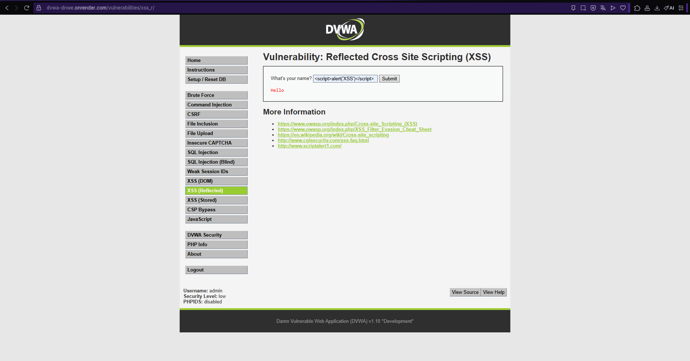
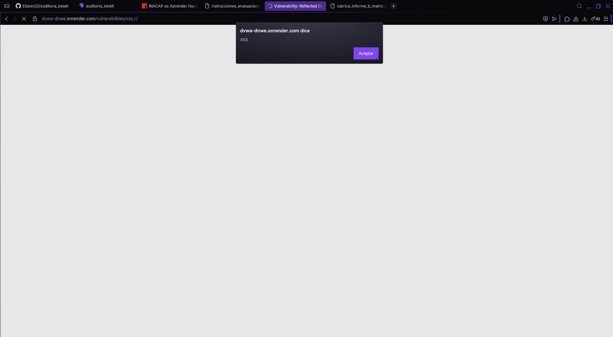

# Cross Site Scripting (Reflected XSS)

## Descripción de la vulnerabilidad

Cross Site Scripting (XSS) es una vulnerabilidad que permite ejecutar código JavaScript dentro del navegador de otro usuario cuando la aplicación no valida correctamente la información que recibe.

En este caso se trabajó con la variante **Reflected XSS**, donde el código malicioso no queda almacenado en el servidor, sino que es enviado mediante una petición y ejecutado cuando la víctima accede a la página.

Si un atacante logra explotar esta vulnerabilidad, podría robar cookies de sesión, modificar el contenido mostrado en la página o engañar al usuario para obtener información personal.

---

# Evidencia de la vulnerabilidad

Durante la auditoría realizada en DVWA, configurado con el nivel de seguridad **Low**, se utilizó el siguiente payload:

```html
<script>alert('XSS')</script>
```

Después de enviar el formulario, el navegador ejecutó correctamente el código JavaScript, mostrando una ventana emergente (alert).

Con esta prueba se comprobó que la aplicación no valida correctamente la entrada del usuario antes de mostrarla nuevamente en la página.

## Evidencia obtenida

**Figura 1. Payload utilizado durante la prueba.**



**Figura 2. Resultado obtenido después de ejecutar el ataque.**



**Figura 3. Resultado obtenido en la calculadora CVSS v3.1.**


---

# Evaluación CVSS v3.1

**Puntaje obtenido:** **6.1 / 10 (Media)**

### Vector CVSS

```text
CVSS:3.1/AV:N/AC:L/PR:N/UI:R/S:C/C:L/I:L/A:N
```

## ¿Qué significa este puntaje?

El puntaje obtenido corresponde a una vulnerabilidad de severidad **Media**.

Aunque la explotación requiere que un usuario interactúe con el contenido generado por el atacante, sigue representando un riesgo importante, ya que permite ejecutar código JavaScript dentro del navegador de la víctima.

Durante la prueba realizada se logró ejecutar un script simple utilizando la función `alert()`, comprobando que la aplicación era vulnerable a Reflected XSS.

## Aplicación al caso de la Municipalidad de Cerro Verde

Si esta vulnerabilidad existiera en el portal municipal, un atacante podría crear enlaces maliciosos para engañar a funcionarios o ciudadanos y ejecutar código JavaScript dentro de su navegador.

Esto podría utilizarse para robar cookies de sesión, capturar información ingresada en formularios o modificar el contenido mostrado al usuario, afectando principalmente la confidencialidad e integridad de la información.

---

# Impacto

Los principales riesgos para la Municipalidad de Cerro Verde serían:

- Robo de cookies de sesión.
- Suplantación de identidad de usuarios autenticados.
- Modificación del contenido mostrado en el portal.
- Captura de información ingresada por ciudadanos.
- Pérdida de confianza en los servicios digitales municipales.

---

# Medidas de mitigación

Para disminuir el riesgo asociado a esta vulnerabilidad se recomienda:

- Validar y sanitizar toda la información ingresada por los usuarios.
- Codificar correctamente la salida antes de mostrarla en pantalla.
- Implementar Content Security Policy (CSP).
- Utilizar cookies con atributos HttpOnly y Secure.
- Mantener actualizados los frameworks utilizados por la aplicación.
- Realizar pruebas periódicas siguiendo las recomendaciones de OWASP Top 10.