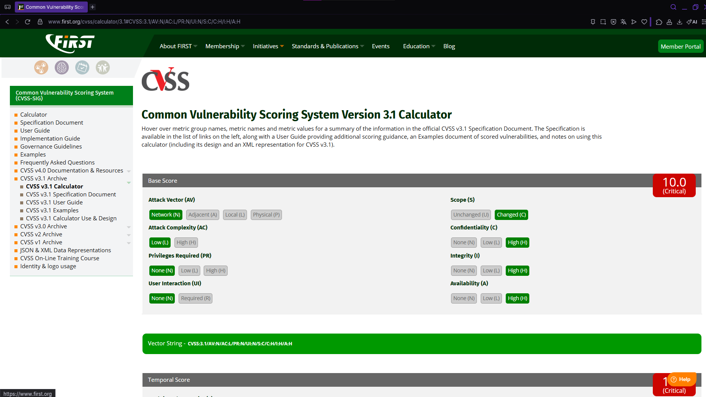

# Command Injection

## Descripción de la vulnerabilidad

Command Injection es una vulnerabilidad que ocurre cuando una aplicación ejecuta comandos del sistema operativo utilizando datos ingresados por el usuario sin realizar una validación adecuada.

Si un atacante logra aprovechar este problema, puede ejecutar comandos directamente sobre el servidor donde se encuentra la aplicación, obteniendo acceso a archivos, información sensible o incluso comprometiendo completamente el sistema.

En un portal como el de la Municipalidad de Cerro Verde, una vulnerabilidad de este tipo representa uno de los riesgos más críticos, ya que podría afectar tanto la información almacenada como la continuidad de los servicios entregados a los ciudadanos.

---

# Evidencia de la vulnerabilidad

Durante la auditoría realizada en DVWA, con el nivel de seguridad configurado en **Low**, se utilizó el siguiente payload:

```bash
127.0.0.1; cat /etc/passwd
```

Al ejecutar la prueba, la aplicación realizó el ping normalmente y posteriormente ejecutó el comando **cat /etc/passwd**, mostrando el contenido del archivo directamente en la página.

Con esto se comprobó que la aplicación estaba ejecutando comandos enviados por el usuario sin validar correctamente la entrada recibida.

## Evidencia obtenida

### Evidencia de explotación


*Figura 1. Ejecución exitosa de Command Injection utilizando el payload `127.0.0.1; cat /etc/passwd`. Como resultado fue posible acceder al contenido del archivo `/etc/passwd`, demostrando que la aplicación ejecuta comandos enviados por el usuario.*

---

### Cálculo CVSS v3.1



*Figura 2. Resultado obtenido mediante la calculadora oficial CVSS v3.1 utilizada para determinar la gravedad de la vulnerabilidad.*

### Vector CVSS

```text
CVSS:3.1/AV:N/AC:L/PR:N/UI:N/S:C/C:H/I:H/A:H
```

## ¿Qué significa este puntaje?

El resultado corresponde a una vulnerabilidad de severidad **Crítica**, lo que indica que puede comprometer completamente el sistema afectado.

Durante la prueba fue posible ejecutar comandos directamente sobre el servidor y acceder al contenido del archivo `/etc/passwd`, demostrando que un atacante podría ejecutar instrucciones del sistema operativo sin restricciones.

## Aplicación al caso de la Municipalidad de Cerro Verde

Si esta vulnerabilidad existiera en el portal de la Municipalidad de Cerro Verde, un atacante podría acceder a archivos internos del servidor, modificar información crítica, instalar software malicioso o incluso dejar fuera de funcionamiento los servicios digitales utilizados por la comunidad.

Debido al nivel de acceso que puede obtenerse, esta vulnerabilidad representa uno de los mayores riesgos para la infraestructura tecnológica de la municipalidad.

---

# Impacto

Los principales riesgos para la Municipalidad de Cerro Verde serían:

- Acceso no autorizado a archivos del servidor.
- Robo de información confidencial.
- Modificación o eliminación de archivos importantes.
- Instalación de malware o puertas traseras.
- Interrupción de los servicios digitales municipales.
- Compromiso total del servidor donde se aloja la aplicación.

---

# Medidas de mitigación

Para reducir el riesgo asociado a esta vulnerabilidad se recomienda:

- Evitar ejecutar comandos del sistema utilizando datos ingresados por el usuario.
- Validar estrictamente todas las entradas mediante listas blancas (Whitelist).
- Ejecutar la aplicación con el menor nivel de privilegios posible.
- Implementar mecanismos de aislamiento entre la aplicación y el sistema operativo.
- Registrar y monitorear intentos de ejecución de comandos sospechosos.
- Realizar auditorías periódicas siguiendo las recomendaciones de OWASP Top 10.
- Mantener actualizados el sistema operativo y los componentes del servidor.